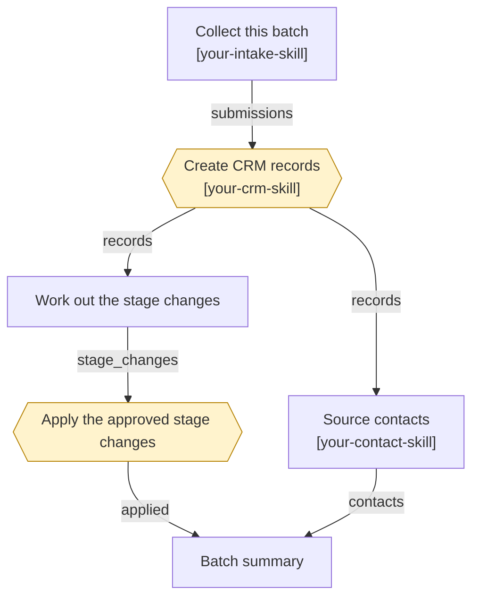

# skillflow

Run your Claude skills as a dependency graph, with real handoffs between them.

If you have built up a library of Claude skills, you have probably noticed that
half of them quietly depend on each other. The descriptions say things like
"typically runs after X". You run them one at a time, in the right order, from
memory, and you copy the output of one into the prompt of the next.

skillflow turns that prose into a file. Each node is one headless Claude run.
Each edge carries a typed artifact. A human can be put in the middle of the chain
where the work stops being reversible.



Diamond nodes are human gates. Everything else runs unattended.

## Install

```bash
npm install -g skillflow
```

You also need Claude Code authenticated for headless use, because skillflow
spawns it:

```bash
npm install -g @anthropic-ai/claude-code && claude login
```

An `ANTHROPIC_API_KEY` in the environment works too. Note that skillflow cannot
borrow the credentials of a Claude desktop session, so run it from a terminal or
from cron rather than from inside another agent.

## Try it

```bash
git clone https://github.com/meaydira/skillflow && cd skillflow
skillflow run examples/hello-chain.yaml -i topic="the Dutch tulip mania"
```

Three nodes, nothing external touched. Afterwards, look at
`.skillflow/runs/<id>/nodes/write/` to see what the last node was actually
handed. That directory is the whole idea.

## The handoff

A node runs inside a working directory that skillflow builds for it:

```
nodes/<id>/
  CLAUDE.md          the brief: its task, and exactly what it owes downstream
  HANDOFF.md         what every upstream node produced, in prose
  inputs/
    <node>/<artifact>/
      summary.md     what this artifact is
      data.json      structured payload, when there is one
      files/         documents, when there are any
  outputs/
    manifest.json    written by the agent to declare what it produced
  workspace/         scratch, discarded
```

An agent declares its results by writing `outputs/manifest.json`:

```json
{
  "artifacts": [
    {
      "name": "accounts",
      "kind": "records",
      "summary": "Created 12 Accounts and 12 Deals. Three submissions were skipped as duplicates of existing accounts, listed in data.skipped.",
      "data": { "created": ["001..."], "skipped": [] }
    }
  ]
}
```

The contract is a file, not a protocol. Any skill you already have works as a
node as long as its prompt tells it to write the manifest, and skillflow puts
those instructions into `CLAUDE.md` for you.

skillflow validates the manifest against what the node declared. A node that
finished talking but produced none of what it promised has failed, and failing
loudly there is much cheaper than discovering it three nodes later.

### Artifact kinds

| kind | what it carries |
| --- | --- |
| `document` | files: decks, spreadsheets, PDFs, reports |
| `records` | structured rows or ids |
| `note` | prose that is itself the product |
| `ref` | a pointer to something in an external system |
| `changeset` | proposed mutations that have **not** been applied |

`summary` is required on every artifact, including file ones. The next agent
reads it before it reads anything else.

## Approval gates

The reason a coding agent can be run unattended is that a branch is free to
throw away. An agent with write access to your CRM has no such thing. So a node
can be gated:

```yaml
- id: propose_stages
  readonly: true
  prompt: Work out which records need a stage change. Do not write anything.
  outputs:
    - name: stage_changes
      kind: changeset

- id: apply_stages
  needs: [propose_stages]
  resources: [crm:main]
  approval:
    when: before
    prompt: Apply these changes. Nothing has been written yet.
  prompt: Apply exactly the approved changeset. Nothing else.
```

`when: before` holds the node until a human approves. `when: after` lets the node
run but holds its **outputs**, so nothing downstream compounds them unreviewed.

Prefer the propose-then-apply shape wherever the work can be split that way. It
is the closest thing ops work has to a diff.

A run does not block waiting for you. It does everything it can, writes the
approval requests, and exits:

```bash
skillflow run workflows/crm-intake.yaml -i batch_date=2026-09-24
skillflow review <run-id>          # read what is waiting, including the changeset
skillflow approve <run-id> apply_stages
skillflow resume <run-id>
```

That is what lets a workflow run from cron at 6am and still have a human in it
at 9am.

## Resource locks

```yaml
resources: [crm:main, spreadsheet:intake]
```

Two nodes holding the same string never run at the same time, across every run on
the machine. Locks are taken in a fixed order and rolled back as a group, so a
contended run loses cleanly instead of deadlocking. Mark read-only nodes with
`readonly: true` so a reader can see which steps can never change anything.

## Resume

Every run appends to `ledger.jsonl`. `skillflow resume` reads it, skips every node
that already completed, and reuses the artifacts they produced.

This matters more here than it does for coding agents. A killed coding run leaves
a dirty worktree. A killed intake run has already written twelve of thirty rows,
and re-running it from the top is the worst thing the tool could do.

## Commands

| command | |
| --- | --- |
| `skillflow run <file>` | execute a workflow. `--dry-run` walks the graph without calling any model |
| `skillflow resume <id>` | continue a paused or partly failed run |
| `skillflow status [id]` | list runs, or show one in detail |
| `skillflow review <id>` | print everything waiting on you, with the changeset |
| `skillflow approve <id> <node>` | grant an approval |
| `skillflow reject <id> <node>` | reject one; everything downstream stops |
| `skillflow validate <file>` | check a workflow and print its stages |
| `skillflow graph <file>` | print it as a mermaid diagram |
| `skillflow logs <id> [node]` | replay the ledger. `--tools` includes tool calls |
| `skillflow artifacts <id>` | list what a run produced |

## Workflow reference

```yaml
name: my-workflow
description: what it does

inputs:
  week_of:
    description: shown in errors and docs
    required: true
  limit:
    default: "25"

connectors:            # MCP servers; a node only gets the ones it names
  salesforce: { ... }

defaults:              # per-node settings fall back to these
  model: claude-opus-5
  permissionMode: acceptEdits
  maxTurns: 80
  timeoutSec: 3600
  idleTimeoutSec: 900

concurrency: 3

nodes:
  - id: example        # required, unique
    name: Human name
    skill: my-skill    # a skill from ~/.claude/skills
    needs: [other]     # upstream nodes; their artifacts are handed over
    readonly: true     # documents that this node cannot change anything
    resources: []      # logical locks
    connectors: []     # which connectors this node may use
    if: "${{ inputs.limit }}"   # falsy skips the node, and its dependents
    retries: 0
    approval:
      when: after      # or: before
      prompt: what you are being asked
    prompt: |
      The instruction. Supports templating.
    outputs:
      - name: thing
        kind: records
        required: true
```

Templates resolve `${{ inputs.x }}`, `${{ run.id }}`, `${{ run.date }}`,
`${{ env.VAR }}` and `${{ nodes.<id>.outputs.<name>.summary }}`. There is
deliberately no expression evaluation: a workflow file is executable
configuration, and every extra capability is a new way for a shared workflow to
surprise the person running it.

## Cost

Every node is a full Claude session, so cost scales with node count, not with how
small each step looks. The three-node `hello-chain` above, which does almost
nothing, runs about $2.20 end to end.

Two things keep that down:

- **Fewer, larger nodes.** Split a pipeline where a handoff or a gate genuinely
  belongs, not to make each step tidy. Every split adds a session.
- **`maxTurns` per node.** The default of 60 is a ceiling, not a target. A node
  that reads two inputs and writes one output rarely needs more than 15.

`skillflow status <id>` breaks cost down per node, which is usually enough to see
which one is worth tuning.

## Scheduling

skillflow has no scheduler of its own, on purpose. Use cron:

```bash
0 6 * * 4 cd /path/to/ops && skillflow run workflows/document-sweep.yaml -i period=$(date +\%Y-\%m-\%d) -i recipient=you@example.com
```

The run pauses at its gates and waits for you.

## Included workflows

The three in `workflows/` are templates, drawn from pipelines that actually run.
They exist as worked examples of the three shapes the artifact model has to cover:

- `crm-intake.yaml` — writes to a system of record, showing both gate patterns
  side by side so you can see when to use which
- `outbound-campaign.yaml` — work that leaves the building, gated before it does
- `document-sweep.yaml` — document handoff between nodes

They are meant to be edited, not run as-is. Replace the `your-*-skill` names with
your own skills, fill in `connectors`, and rewrite the prompts for your systems.
The structure is the part worth keeping: which steps are `readonly`, where the
gates sit, and what each node hands on.

## Status

Early. The scheduler, handoffs, gates, locks, ledger and resume are covered by
tests (`npm test`). What is thinnest is breadth of real-world use: it has been
exercised against a handful of pipelines, not hundreds.

Two things it does not do yet, both deliberate:

- **No connector credential management.** You point `connectors` at MCP servers
  you have already configured. Remote servers behind interactive OAuth are the
  genuine hard part of running agents unattended, and pretending otherwise would
  be worse than saying so.
- **No web UI.** The run directory is the interface.

## Prior art

The design owes a debt to [Multica](https://github.com/multica-ai/multica),
which solves a neighbouring problem: agents as assignees on an issue tracker.
Several ideas here were taken from reading it, in particular delivering the brief
as a file in the working directory rather than as an inline system prompt, and
keeping the idle watchdog separate from the wall-clock one. No code was copied,
and skillflow is a different thing: a dependency graph with typed handoffs rather
than a tracker.

## License

MIT
