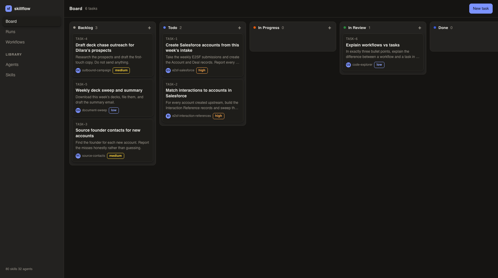
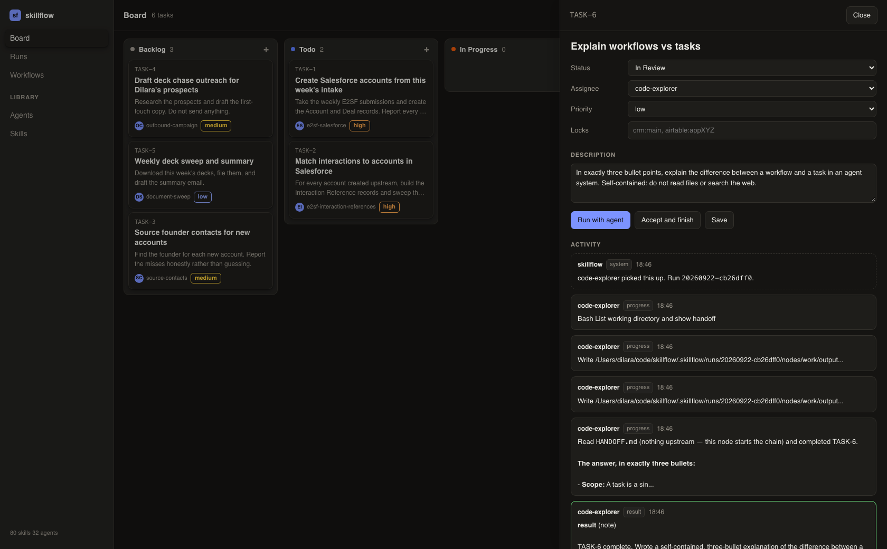
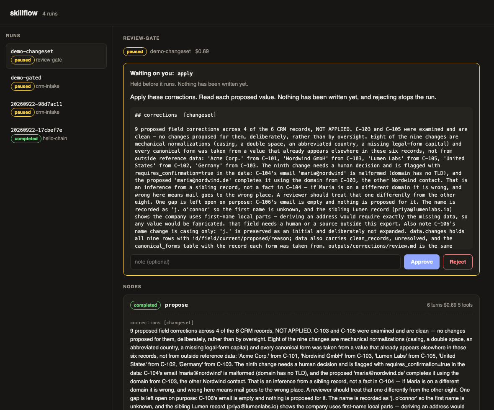

# skillflow

A board for your Claude agents. Assign a task, watch an agent pick it up, give
feedback, decide when it is done. Chain agents into workflows when the steps are
known in advance.



Two units of work, because work arrives in two shapes:

- **A task** is a thing you want done. You assign it to one of your agents or
  skills, it works, and it comes back to In Review. You read what it did and
  either accept it or send it back with feedback, and it tries again knowing
  what you said.
- **A workflow** is a chain you already know the shape of. Agent one creates the
  accounts, agent two matches the interactions, agent three sources the
  contacts. Each step hands typed artifacts to the next.

A task can be assigned to a workflow, so a five step chain sits on the board as
one card.

Anything that cannot be undone can be held for a human. The agent works out what
it wants to change and writes it down, you read the actual proposed values, and
only then does the next step apply exactly what you approved.

Everything lives in files under `.skillflow/`. No database, no account, nothing
leaves your machine except the model calls.

## Install

### Desktop app (macOS)

```bash
git clone https://github.com/meaydira/skillflow && cd skillflow
npm install && npm run dist
```

That produces `release/mac-arm64/skillflow.app`. Drag it to Applications and
open it. The app bundles its own Claude Code, so nothing else needs installing,
but it does need to be signed in once (see below).

It keeps its tasks and runs in a workspace folder, `~/skillflow` by default.
Change it from the skillflow menu, or point it at a folder you already have.

Unsigned, so a copy you build yourself opens normally, but a copy you send
someone else will be stopped by Gatekeeper until it is signed and notarised.

### Command line

```bash
git clone https://github.com/meaydira/skillflow && cd skillflow
npm install && npm run build && npm link
```

`npm link` puts `skillflow` on your PATH. Skip it and use `npx tsx src/cli.ts`
in place of `skillflow` everywhere below.

### Signing in

Either way, Claude Code has to be authenticated once:

```bash
npm install -g @anthropic-ai/claude-code
claude auth login
```

An `ANTHROPIC_API_KEY` in the environment works instead. The login is stored in
your keychain and shared with the desktop app, so this is a one-time step.

skillflow cannot borrow the credentials of a Claude desktop session, so run it
from a terminal, from the app, or from cron, rather than from inside another
agent.

## Try it

```bash
skillflow ui
```

Open http://127.0.0.1:4600, click **New task**, describe something small,
assign it to one of your agents, and press Run.

Or run a workflow from the terminal:

```bash
skillflow run examples/hello-chain.yaml -i topic="the Dutch tulip mania"
```

Three nodes, nothing external touched. Then look at
`.skillflow/runs/<id>/nodes/write/` to see what the last node was actually
handed. That directory is the whole idea.

For the pattern that matters, run the gated one:

```bash
skillflow run examples/review-gate.yaml
```

It proposes changes to six records, then stops and waits for you.

## The board

```bash
skillflow ui        # http://127.0.0.1:4600
```

Drag cards between columns to change status. Click one to open it.



Inside a task you set the assignee, priority and resource locks, edit the
description, and read everything that has happened on it. **Run with agent**
starts the work. The agent posts as it goes and moves the card to In Review when
it is finished.

From there you either **Accept and finish**, or write what is wrong and **Send
back with feedback**. Sending back re-runs the agent with your feedback and its
own previous answer in context, so the second attempt is a revision rather than a
repeat. Tasks are linkable at `#TASK-12`.

### Approving what cannot be undone

When a run hits an approval gate, the gate appears on the task with the proposed
changes rendered in full:



Above: the agent proposed nine corrections, flagged one as an inference that
could misroute mail, and left two clean records alone. Nothing has been written.
Approving lets the next node apply exactly this and nothing else.

The board binds to loopback and has no login, because it is a window onto files
you already own on a machine you are already sitting at.

## Using skills and agents you already have

```bash
skillflow list            # everything installed on this machine
skillflow list skills --search deck
skillflow list agents
```

Put the name it prints on a node:

```yaml
- id: research
  skill: docsend-downloader     # a skill from ~/.claude/skills or a plugin
- id: review
  agent: code-reviewer          # a subagent from ~/.claude/agents or a plugin
```

A node can use either, or neither. With neither, the prompt is the whole
instruction, which is often enough.

To start a new workflow:

```bash
skillflow new workflows/my-thing.yaml -n fetch check publish
```

That writes a commented skeleton with those three nodes wired in order, ready to
edit.

## The handoff

A node runs inside a working directory that skillflow builds for it:

```
nodes/<id>/
  CLAUDE.md          the brief: its task, and exactly what it owes downstream
  HANDOFF.md         what every upstream node produced, in prose
  inputs/
    <node>/<artifact>/
      summary.md     what this artifact is
      data.json      structured payload, when there is one
      files/         documents, when there are any
  outputs/
    manifest.json    written by the agent to declare what it produced
  workspace/         scratch, discarded
```

An agent declares its results by writing `outputs/manifest.json`:

```json
{
  "artifacts": [
    {
      "name": "accounts",
      "kind": "records",
      "summary": "Created 12 Accounts and 12 Deals. Three submissions were skipped as duplicates of existing accounts, listed in data.skipped.",
      "data": { "created": ["001..."], "skipped": [] }
    }
  ]
}
```

The contract is a file, not a protocol. Any skill you already have works as a
node as long as its prompt tells it to write the manifest, and skillflow puts
those instructions into `CLAUDE.md` for you.

skillflow validates the manifest against what the node declared. A node that
finished talking but produced none of what it promised has failed, and failing
loudly there is much cheaper than discovering it three nodes later.

### Artifact kinds

| kind | what it carries |
| --- | --- |
| `document` | files: decks, spreadsheets, PDFs, reports |
| `records` | structured rows or ids |
| `note` | prose that is itself the product |
| `ref` | a pointer to something in an external system |
| `changeset` | proposed mutations that have **not** been applied |

`summary` is required on every artifact, including file ones. The next agent
reads it before it reads anything else.

## Approval gates

The reason a coding agent can be run unattended is that a branch is free to
throw away. An agent with write access to your CRM has no such thing. So a node
can be gated:

```yaml
- id: propose_stages
  readonly: true
  prompt: Work out which records need a stage change. Do not write anything.
  outputs:
    - name: stage_changes
      kind: changeset

- id: apply_stages
  needs: [propose_stages]
  resources: [crm:main]
  approval:
    when: before
    prompt: Apply these changes. Nothing has been written yet.
  prompt: Apply exactly the approved changeset. Nothing else.
```

`when: before` holds the node until a human approves. `when: after` lets the node
run but holds its **outputs**, so nothing downstream compounds them unreviewed.

Prefer the propose-then-apply shape wherever the work can be split that way. It
is the closest thing ops work has to a diff.

A run does not block waiting for you. It does everything it can, writes the
approval requests, and exits:

```bash
skillflow run workflows/crm-intake.yaml -i batch_date=2026-09-24
skillflow review <run-id>          # read what is waiting, including the changeset
skillflow approve <run-id> apply_stages
skillflow resume <run-id>
```

That is what lets a workflow run from cron at 6am and still have a human in it
at 9am.

## Connectors and permissions

Every claude.ai connector you are signed in to is visible to a headless run. That
is what makes your existing skills work unattended, and it is also the danger:
an unattended agent with your CRM, your inbox and Slack is one bad inference
away from a customer email.

So skillflow does not bypass permissions the way coding-agent tools do (safe
there only because git can undo anything). It classifies every connector call
and applies a policy per task or step:

- **Reads** go through without asking.
- **Writes** are governed by `writes:` on the task or step:
  - `ask` (the default): the agent stops at the call, the exact payload appears
    on the task with **Allow once**, **Allow every &lt;tool&gt; this run** and
    **Deny**, and the agent continues when you decide. Its watchdogs stand down
    while it waits, so a long lunch does not kill the run.
  - `allow`: writes go through. Use it for a skill you trust, and pair it with an
    approval gate on the step.
  - `deny`: the agent is told to report what it would have changed instead.
- **Connectors** on a task or step restrict which servers it may touch at all,
  reads included. Empty means any connected one.

A denied call tells the agent not to try another route and to report what it
would have changed, and in practice it does exactly that.

What counts as a write is judged by tool name, deliberately broadly: anything not
recognisably a read is treated as a write. The cost of gating a read is one
click; the cost of waving through a write is a customer email.

`skillflow` lists your connectors from `claude mcp list` and shows which need
signing in again. That is done from a terminal with `claude mcp` or from the
claude.ai connector settings, not from skillflow.

## Resource locks

```yaml
resources: [crm:main, spreadsheet:intake]
```

Two nodes holding the same string never run at the same time, across every run on
the machine. Locks are taken in a fixed order and rolled back as a group, so a
contended run loses cleanly instead of deadlocking. Mark read-only nodes with
`readonly: true` so a reader can see which steps can never change anything.

## Resume

Every run appends to `ledger.jsonl`. `skillflow resume` reads it, skips every node
that already completed, and reuses the artifacts they produced.

This matters more here than it does for coding agents. A killed coding run leaves
a dirty worktree. A killed intake run has already written twelve of thirty rows,
and re-running it from the top is the worst thing the tool could do.

## Commands

| command | |
| --- | --- |
| `skillflow run <file>` | execute a workflow. `--dry-run` walks the graph without calling any model |
| `skillflow resume <id>` | continue a paused or partly failed run |
| `skillflow status [id]` | list runs, or show one in detail |
| `skillflow review <id>` | print everything waiting on you, with the changeset |
| `skillflow approve <id> <node>` | grant an approval |
| `skillflow reject <id> <node>` | reject one; everything downstream stops |
| `skillflow validate <file>` | check a workflow and print its stages |
| `skillflow graph <file>` | print it as a mermaid diagram |
| `skillflow logs <id> [node]` | replay the ledger. `--tools` includes tool calls |
| `skillflow artifacts <id>` | list what a run produced |
| `skillflow ui` | local web view with approve and reject buttons |
| `skillflow list [skills\|agents]` | what is installed and usable as a node |
| `skillflow new <file>` | scaffold a workflow to edit |

## Workflow reference

```yaml
name: my-workflow
description: what it does

inputs:
  week_of:
    description: shown in errors and docs
    required: true
  limit:
    default: "25"

connectors:            # MCP servers; a node only gets the ones it names
  salesforce: { ... }

defaults:              # per-node settings fall back to these
  model: claude-opus-5
  permissionMode: acceptEdits
  maxTurns: 80
  timeoutSec: 3600
  idleTimeoutSec: 900

concurrency: 3

nodes:
  - id: example        # required, unique
    name: Human name
    skill: my-skill    # a skill from ~/.claude/skills or a plugin
    agent: my-agent    # or run the node as one of your subagents
    needs: [other]     # upstream nodes; their artifacts are handed over
    readonly: true     # documents that this node cannot change anything
    resources: []      # logical locks
    connectors: []     # connectors it may use, by name; empty means any
    writes: ask        # ask | allow | deny, for calls that change something
    if: "${{ inputs.limit }}"   # falsy skips the node, and its dependents
    retries: 0
    approval:
      when: after      # or: before
      prompt: what you are being asked
    prompt: |
      The instruction. Supports templating.
    outputs:
      - name: thing
        kind: records
        required: true
```

Templates resolve `${{ inputs.x }}`, `${{ run.id }}`, `${{ run.date }}`,
`${{ env.VAR }}` and `${{ nodes.<id>.outputs.<name>.summary }}`. There is
deliberately no expression evaluation: a workflow file is executable
configuration, and every extra capability is a new way for a shared workflow to
surprise the person running it.

## Cost

Every node is a full Claude session, so cost scales with node count, not with how
small each step looks. The three-node `hello-chain` above, which does almost
nothing, runs about $2.20 end to end.

Two things keep that down:

- **Fewer, larger nodes.** Split a pipeline where a handoff or a gate genuinely
  belongs, not to make each step tidy. Every split adds a session.
- **`maxTurns` per node.** The default of 60 is a ceiling, not a target. A node
  that reads two inputs and writes one output rarely needs more than 15.

`skillflow status <id>` breaks cost down per node, which is usually enough to see
which one is worth tuning.

## Scheduling

skillflow has no scheduler of its own, on purpose. Use cron:

```bash
0 6 * * 4 cd /path/to/ops && skillflow run workflows/document-sweep.yaml -i period=$(date +\%Y-\%m-\%d) -i recipient=you@example.com
```

The run pauses at its gates and waits for you.

## Included workflows

The three in `workflows/` are templates, drawn from pipelines that actually run.
They exist as worked examples of the three shapes the artifact model has to cover:

- `crm-intake.yaml` — writes to a system of record, showing both gate patterns
  side by side so you can see when to use which
- `outbound-campaign.yaml` — work that leaves the building, gated before it does
- `document-sweep.yaml` — document handoff between nodes

They are meant to be edited, not run as-is. Replace the `your-*-skill` names with
your own skills, fill in `connectors`, and rewrite the prompts for your systems.
The structure is the part worth keeping: which steps are `readonly`, where the
gates sit, and what each node hands on.

## Status

Early. The scheduler, handoffs, gates, locks, ledger, resume, discovery and the
task board are covered by tests (`npm test`, 51 of them). What is thinnest is
breadth of real-world use: it has been exercised against a handful of pipelines,
not hundreds.

Two things it does not do yet, both deliberate:

- **No connector sign-in.** skillflow uses the connectors your Claude Code is
  already signed in to and tells you which ones need re-authorising, but the
  OAuth itself happens in Claude Code or on claude.ai, not here.
- **A run waiting on a permission dies with the app.** The request stays on
  disk, but the agent process does not survive a quit. Resume re-runs that step
  from the start.
- **No multi-machine support.** Everything runs on the machine you start it on.
  The locks are local files, so two laptops will not see each other's.
- **Single user.** The board has no login and no notion of who is who beyond the
  username it records on your comments.

## Prior art

The design owes a debt to [Multica](https://github.com/multica-ai/multica),
which solves a neighbouring problem: agents as assignees on an issue tracker.
Several ideas here were taken from reading it, in particular delivering the brief
as a file in the working directory rather than as an inline system prompt, and
keeping the idle watchdog separate from the wall-clock one. No code was copied,
and skillflow is a different thing: a dependency graph with typed handoffs rather
than a tracker.

## License

MIT
